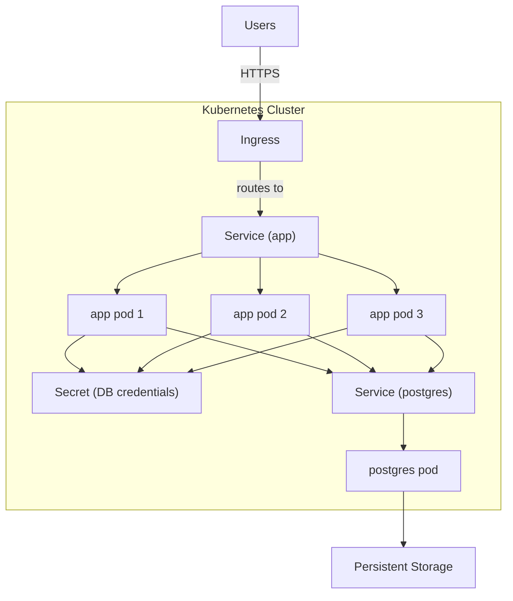

# Step 1 — Current System Problems

## What is the problem?

- Secrets are in plain text: anyone who can read a config file or the logs can see credentials directly.
- There is no data persistence plan: If a service restarts, everything in memory is gone and there is no way to recover it.
- Everything runs as a single instance: One crash and the whole system is down with nothing to fall back to.

## Why does it matter?

Secrets in plain text: Can be stolen by attackers

No data persistence: Any restart or crash silently discards state.

Single instance: Every unexpected event takes the whole system down.

## What failure or operational risk could it cause?

Secrets in plain text: A leaked database password means an attacker can read or delete all user data.

No data persistence: A process restart during a deployment or an OOM kill loses everything since the last time it ran.

Single instance: Any crash, scheduled restart, or hardware failure is an unplanned outage.

# Step 3 — Production Architecture

## Design

The application is deployed as a `Deployment` with 3 replicas, and is exposed with an `Ingress`. There's a `RollingUpdate` so there's no downtime. The database uses a persistant storage so we don't lose data. Secrets are stored in Kubernetes `Secret` objects and mounted at runtime — never baked into images or config files.

Rollout strategy: `RollingUpdate` with `maxUnavailable: 0` and `maxSurge: 1`. Kubernetes replaces one pod at a time, only proceeding when the new pod passes its readiness probe. A bad deploy can be rolled back with `kubectl rollout undo`.

## Diagram

# Step 4 — Operational Strategy

## How does the system scale?

By increasing the number of replicas.

## How are updates deployed safely?

Updates are deployed safely with 0 downtime using the RollingUpdate

## How are failures detected?

With readiness and liveness healthchecks

## Which Kubernetes controllers handle recovery?

The Deployment controller (via ReplicaSet) recreates crashed app pods. The StatefulSet controller restarts the postgres pod while keeping its PVC attached.

# Step 5 — Weakest Point

The database is the weakest point. The app runs three replicas and can lose one without users noticing, but postgres is a single StatefulSet pod with no replica or automatic failover. If it crashes, every app pod loses its connection at the same time and the whole system goes down until Kubernetes restarts it, which takes anywhere from a few seconds to a minute or more depending on the node state.
